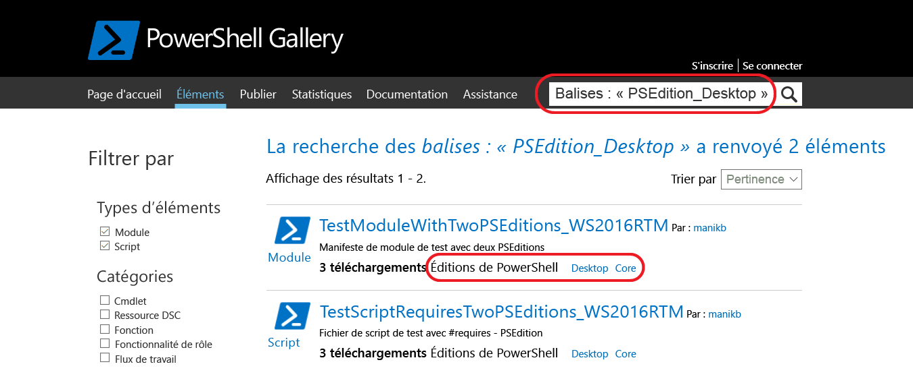
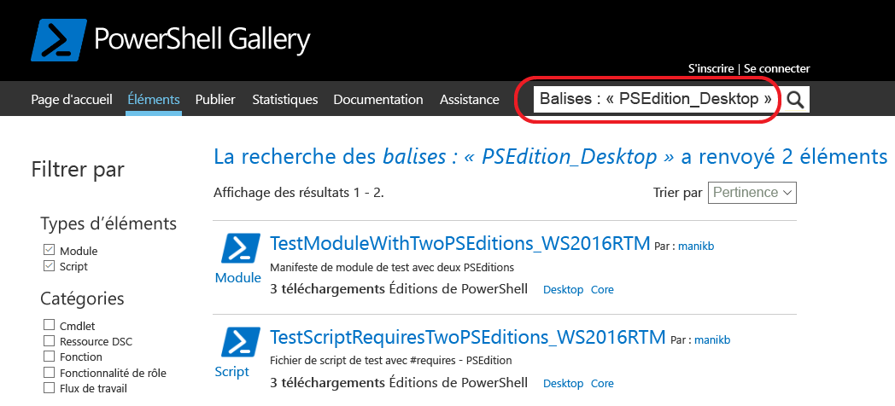

# Packages avec des éditions PowerShell compatiblesPackages with compatible PowerShell Editions

À compter de la version 5.1, PowerShell est disponible dans différentes éditions qui indiquent la compatibilité de la plateforme et les différents ensembles de fonctionnalités.Starting with version 5.1, PowerShell is available in different editions which denote varying feature sets and platform compatibility.

- **Desktop Edition :** basée sur le .NET Framework, elle fournit la compatibilité avec les scripts et les modules qui ciblent des versions de PowerShell exécutées sur des éditions complètes de Windows telles que Server Core et Windows Desktop.**Desktop Edition:** Built on .NET Framework and provides compatibility with scripts and modules targeting versions of PowerShell running on full footprint editions of Windows such as Server Core and Windows Desktop.
- **Core Edition :** basée sur .NET Core, elle fournit la compatibilité avec les scripts et les modules qui ciblent des versions de PowerShell exécutées sur des éditions réduites de Windows telles que Nano Server et Windows IoT.**Core Edition:** Built on .NET Core and provides compatibility with scripts and modules targeting versions of PowerShell running on reduced footprint editions of Windows such as Nano Server and Windows IoT.

## PowerShell Gallery extrait des métadonnées d’éditions PS prises en charge et vous permet de filtrer les packages compatibles pour des éditions PowerShell spécifiquesPowerShell Gallery extracts supported PSEditions metadata and allows you to filters the packages compatible for specific PowerShell Editions

Si des éditions PS compatibles sont spécifiées pour un package, elles sont répertoriées dans le cadre des « Éditions PowerShell » dans la page d’affichage du package et également dans les résultats des packages.If a package has compatible PSEditions specified, they will be listed as part of 'PowerShell Editions' in the package display page and also in packages results.

## Rechercher des packages dans l’interface utilisateur PowerShell Gallery qui fonctionnent sur PowerShellCoreSearch for packages in the gallery UI which works on PowerShellCore

Utiliser Tags:"PSEdition_Desktop" et Tags:"PSEdition_Core" pour filtrer les packages sur PowerShell Gallery.Use Tags:"PSEdition_Desktop" and Tags:"PSEdition_Core" to filters the packages on PowerShell Gallery.

### Utiliser Tags:"PSEdition_Core" pour rechercher les éléments compatibles avec l’édition PowerShell Core.Use Tags:"PSEdition_Core" to search items compatible with PowerShell Core Edition.

### Utiliser Tags:"PSEdition_Desktop" pour rechercher les éléments compatibles avec l’édition PowerShell Desktop.Use Tags:"PSEdition_Desktop" to search items compatible with PowerShell Desktop Edition.

## Plus d’informations sur la création et la recherche des packages avec des éditions PowerShell compatiblesMore details on authoring and finding the packages with compatible PowerShell Editions

- [Modules avec des éditions PSModules with PSEditions](../../concepts/module-psedition-support.md)
- [Scripts avec des éditions PSScripts with PSEditions](../../concepts/script-psedition-support.md)
