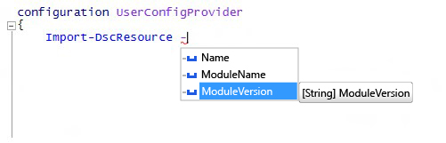

# <a name="import-dscresource-keyword-supports--moduleversion-parameter"></a>Le mot clé Import-DscResource prend en charge le paramètre -ModuleVersion

Nous avons ajouté un nouveau paramètre au mot-clé dynamique `Import-DscResource` disponible lors de la création de configurations DSC. Les auteurs de configuration peuvent désormais spécifier exactement la version du module à partir de laquelle charger les ressources DSC. La nouvelle syntaxe du mot clé est la suivante :

```powershell
Import-DscResource [-Name <ResourceName(s)>] [-ModuleName <ModuleName(s)>] [-ModuleVersion <ModuleVersion>]
```

* **Name** : noms d’une ou plusieurs ressources à importer.
* **ModuleName** : noms de modules ou objets ModuleSpecification d’un ou plusieurs modules à importer.
* **ModuleVersion** : version du module à importer. En cas d’utilisation, ModuleName doit représenter un seul module par nom.

Dans Windows PowerShell ISE, il apparaît avec IntelliSense :



**Remarque** : vous pouvez utiliser le paramètre `–ModuleVersion` uniquement avec le paramètre `–ModuleName`. Vous ne pouvez pas l’utiliser avec des noms de ressources utilisant uniquement le paramètre `–Name`.

Avant cela, la seule façon de spécifier la version du module lors du chargement des ressources DSC consistait à utiliser l’objet de spécification Module, par exemple : `–ModuleName @{ModuleName="UserConfigProvider";ModuleVersion="3.0"}`
